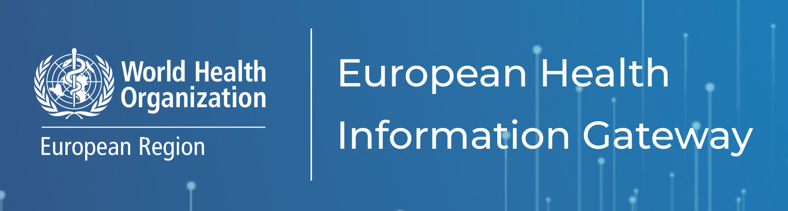

```{r setup, include = FALSE}
knitr::opts_chunk$set(echo = FALSE)
# cool -> https://rpubs.com/eli_3357/ioslidess
```

```{css, echo = FALSE}
.img-row, .img-row > p {
  display: flex; 
  align-items: center; 
  justify-content: center;
}
```

## Introduction

### Application R Shiny

::: img-row
{width="33%"} {width="33%"}
:::

### Données

::: blue3
*Deaths(\#), Alcohol abuse (including alcoholic psychosis)*
:::

::: img-row
{width="50%"}
:::

## Présentation de l'application | Interface


## Présentation de l'application | Tableau

...

---
### HHHE
